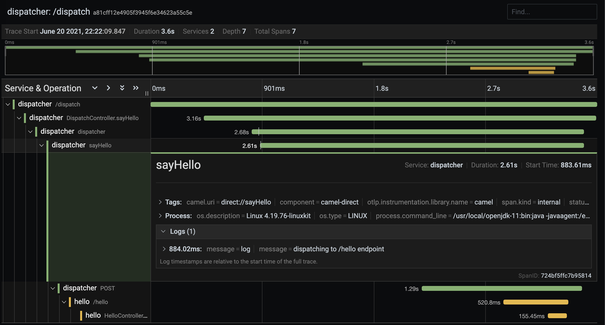

# Distributed Logs and Tracing with Spring, Apache Camel, OpenTelemetry and Grafana: Example

## Introduction

This project is an example app to showcase [`camel-opentelemetry`](https://camel.apache.org/components/3.7.x/others/opentelemetry.html) integration in a Spring Boot app. Apache Camel has added OpenTelemetry support in the 3.5 release. The official documentation doesn't focus on how to set everything up for logs and traces visibility, so the goal of this example is to fill this gap.        

[OpenTelemetry](https://opentelemetry.io/) is an open-source project resulted from merging of OpenCensus and OpenTracing. Its purpose is to enable an application's observability by providing a set of standardized data collection tools for capturing and exporting metrics, logs and traces. It's one of the most active CNCF projects these days.

Using [Camel](https://camel.apache.org/) in tandem with OpenTelemetry instrumentation allows us to have distributed tracing across different routes in one or more services, and to link application logs with these traces, which makes it a great alternative to ELK and similar solutions.        

Important note: this example uses Apache Camel 3.10 (the last available version as of June 2021), which depends on OpenTelemetry SDK for Java version 0.15.0. OpenTelemetry specification and its tools develop rapidly, now beyond 1.x release. In the Camel tracker I see the plans to upgrade dependency but today make sure 0.15.0 is used to run this example smoothly.     

## Launch 

I used Maven 3.8.1 + JDK 11 to create the demo, so it should work with all version from these onwards.

Steps to launch and try:

1. Prepare Docker 

Install Loki driver to Docker (to stream logs from the standard output of a container)

```sh
docker plugin install grafana/loki-docker-driver:latest --alias loki --grant-all-permissions
```

Create a network for the demo services:

```sh
docker network create tempo-net
```

2. Pack the service with Maven

```sh
mvn package
```

3. Build the container image

```sh
docker build . -t hello-service:1.0.0
```

4. Run the docker-compose script to bring up the demo

```sh
docker-compose run
```

5. Open a web browser and navigate to the Grafana dashboard: `http://localhost:3000`. Go to the Configuration->Data Sources menu item.

6. Add new Tempo data source (a storage for traces)


7. Add new Loki data source (a storage for logs)


Configure "Derived Field" in Loki Data Source to relate logs with traces


8. Send a sample request 

```sh
curl http://localhost:8080/dispatch?name=Ada
```

9. Open the "Explore" board in Grafana to browse through the logs in Loki and the traces in Tempo


## How it works

The project is a Spring Boot web application named 'hello-service' serving 2 endpoints. `/hello` responds with "Hello, ${name}" and `/dispatch` passes the request to a downstream service. 

The docker-compose config spins up 5 container instances:
- **hello-service (1)** (container "dispatch") accepts requests and dispatches them down to the **hello-service (2)**  
- **hello-service (2)** (container "hello") handles dispatched requests 
- **loki** is a logs storage
- **tempo** is a traces storage
- **grafana** is a web dashboard with loki/tempo data visualizations

Interacting **hello-service (1)** and **hello-service (2)** are here to demonstrate how OpenTelemetry traces requests across different containers.   

The architecture overview:


Both 'hello' services send logs to Loki via [`loki-docker-driver`](https://grafana.com/docs/loki/latest/clients/docker-driver/) and traces to Tempo via the OpenTelemetry exporter. Grafana uses Loki and Tempo as data sources. Collected logs are linked to the trace data by using traceId assigned by the OpenTelemetry instrumentation.  

### Service

[OpenTelemetry instrumentation](https://github.com/open-telemetry/opentelemetry-java-instrumentation) dynamically captures telemetry from a number of popular Java frameworks. To plug it in, add `opentelemetry-javaagent-all.jar` as a javaagent of the JAR application. This preparation is done in the Dockerfile.

For the Camel integration it's important that we use `opentelemetry-javaagent-all.jar` [version 0.15.0](https://github.com/open-telemetry/opentelemetry-java-instrumentation/tree/v0.15.x) as [`camel-opentelemetry`](https://camel.apache.org/components/3.7.x/others/opentelemetry.html) depends on this OTel Java SDK release.  

```dockerfile
ADD /agent/opentelemetry-javaagent-all.jar /etc/agent/opentelemetry-javaagent-all.jar

ENTRYPOINT ["java", "-javaagent:/etc/agent/opentelemetry-javaagent-all.jar" , "-jar", "observable-service.jar"]
```

For Camel 3.5+ it's required to add the `camel-opentelemetry-starter` dependency. Then, in a `RouteBuilder` class, set up the tracer as the following:

```java
OpenTelemetryTracer ott = new OpenTelemetryTracer();
ott.init(this.getContext());
```
The docker-compose configuration has a few items to highlight.
- `OTEL_EXPORTER_OTLP_ENDPOINT` is an endpoint where to send the opentelemetry data. In our case it's the Tempo's receiver.
- We don't send metrics in this demo, so it's disabled to hide all related warnings.
- The downstream endpoint point to the address of the second service to show how distributed tracing works.  
- The `logging` sections states that the container's stdout should be pipelined to the Loki storage by using the [`loki-docker-driver`](https://grafana.com/docs/loki/latest/clients/docker-driver/).

```yaml
dispatch-service:
  image: hello-service:1.0.0
  container_name: dispatch
  networks:
    - "tempo-net"
  ports:
    - "8080:8080"
  environment:
    - OTEL_EXPORTER_OTLP_ENDPOINT=http://tempo:55680
    - OTEL_EXPORTER_OTLP_INSECURE=true
    - OTEL_METRICS_EXPORTER=none
    - OTEL_RESOURCE_ATTRIBUTES=service.name=dispatcher
    # sends requests to the 'hello-service' container
    - SRV_DOWNSTREAM_ENDPOINT=http://hello:8080/hello
  logging:
    driver: loki
    options:
      loki-url: "http://localhost:3100/loki/api/v1/push"
```

The second service instance has the similar setup except for the fact that it has no downstream service.

In `application.properties`, the `logging.pattern` formats log output in a way to include **traceId** and **spanId**. It's necessary for the system to be able to index logs and link them to traces.

### Loki

[Loki](https://grafana.com/oss/loki/) is a scalable log aggregation system to use with Grafana.

The Loki config is pretty much default. It exposes port 3100 so all the other docker containers can send logs there. 

```yaml
loki:
  hostname: "loki"
  image: grafana/loki:2.2.0
  ports:
    - "3100:3100"
  networks:
    - "tempo-net"
  command: "-config.file=/etc/loki/local-config.yaml"
```

### Tempo

[Tempo](https://grafana.com/oss/tempo/) is a scalable trace storage. It has receivers for Jaeger, Zipkin and OpenTelemetry.

The `tempo-config.yaml` is mounted from the project. It disables auth and specifies that Tempo instance should expose an OpenTelemetry receiver. The default OTel port is 55680.

```yaml
tempo:
    hostname: "tempo"
    image: grafana/tempo:latest
    networks:
      - "tempo-net"
    volumes:
      - ./tempo-config.yaml:/etc/tempo-config.yaml
    command: "-config.file=/etc/tempo-config.yaml"
```

### Grafana

[Grafana](https://grafana.com/) is a visualization and monitoring software that can connect to a wide variety of data sources and query them. 

After all set and executed as in the "Launch" section above, browse to the Grafana UI at `http://localhost:3000`. Open the "Explore" view and switch to the Loki view using to dropdown on the top.

Searching for `{container_name="dispatch"}` will output the recent logs for the **hello-service (1)** running in the `dispatch` container.

Click on an entry that has a trace ID. It would unfold a detailed info on the log entry. Next to the "traceId" field there's a button that would carry us to the corresponding tracing.   


Voilà, we've got to the distributed tracing for this request. Each span has the corresponding log entries grouped under the "Logs" box on this panel.    

